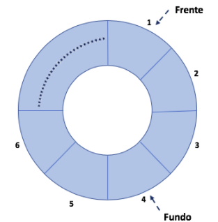

# Filas Lineares: Implementação em C

 
 
 
 

 

 

Das estruturas que compõe os modelos lineares, o tipo de dados Fila é a mais complexo. Nessa estrutura, ao contrário de termos ponteiros para primeiro e último, temos ponteiros para frente e fundo. Isso é necessário porque na fila, ambos os ponteiros são dinâmicos, ou seja, se movimentam com as inserções e remoções.  Veja uma representação gráfica desse modelo de estrutura na figura abaixo.

	 

Observe que a estrutura de uma fila é circular e os ponteiros de frente e fundo gerenciam onde a fila começa e onde ela termina. Uma vez que não temos esse tipo de estrutura em linguagem de programação, o que fazemos é adaptar em um vetor comum regras que permitam que ele atue sob tal representatividade. Conforme pode ser observado no código, utilizamos do conceito de mod (i.e., %) nos procedimentos de enfileirar e desenfileirar para: (1) avaliar se a fila se encontra cheia e (2) para incrementar o ponteiro de fundo adequadamente, evitando que essa operação estoure a indexação do vetor.

# Compilação e Execução

A lista linear disponibilizada possui um arquivo Makefile que realiza todo o procedimento de compilação e execução. Para tanto, temos as seguintes diretrizes de execução:

| Comando                |  Função                                                                                           |                     
| -----------------------| ------------------------------------------------------------------------------------------------- |
|  `make clean`          | Apaga a última compilação realizada contida na pasta build                                        |
|  `make`                | Executa a compilação do programa utilizando o gcc, e o resultado vai para a pasta build           |
|  `make run`            | Executa o programa da pasta build após a realização da compilação                                 |